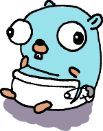

<!-- markdownlint-disable-next-line MD022 -->
# `noleak`


[](https://pkg.go.dev/github.com/thediveo/noleak)
[](https://img.shields.io/github/license/thediveo/noleak)
[](https://goreportcard.com/report/github.com/thediveo/noleak)

`noleak` complements [Gomega](https://github.com/onsi/gomega) with goroutine
discovery and leak matchers.

## Basic Usage

In your project (with a `go.mod`) run `go get github.com/thediveo/noleak` to get
and install the latest stable release.

```go
AfterEach(func() {
    // Notice: Goroutines, not: Goroutines()
    Eventually(Goroutines).ShouldNot(HaveLeaked())
})
```

In case there are "background" goroutines from database drivers, container
engine clients, et cetera, you can take a "snapshot" of good goroutines before
each test and then afterwards filter out the known good goroutines:

```go
var ignoreGood []goroutine.Goroutine

BeforeEach(func() {
    ignoreGood = Goroutines()
})

AfterEach(func() {
    Eventually(Goroutines).ShouldNot(HaveLeaked(ignoreGood))
})
```

For more details, please refer to the [noleak package documentation](https://pkg.go.dev/github.com/thediveo/noleak).

## Credits

`noleak` has been heavily inspired by [Uber's
goleak](https://github.com/uber-go/goleak) goroutine leak detector. That's
definitely a fine piece of work!

But then why another goroutine leak package? After a deep analysis of Uber's
`goleak` we decided against crunching goleak somehow half-assed into the Gomega
TDD matcher ecosystem. In particular, reusing and wrapping of the existing Uber
implementation would have become very awkward: `goleak.Find` combines all the
different elements of getting actual goroutines information, filtering them,
arriving at a leak conclusion, and even retrying multiple times all in just one
single exported function. Unfortunately, `goleak` makes gathering information
about all goroutines an internal matter, so we cannot reuse such functionality
elsewhere.

Users of the Gomega ecosystem are already experienced in arriving at conclusions
and retrying temporarily failing expectations: Gomega does it in form of
`Eventually().ShouldNot()`, and (without the trying aspect) with
`Expect().NotTo()`. So what is missing is only a goroutine leak detector in form
of the `HaveLeaked` matcher, as well as the ability to specify goroutine filters
in order to sort out the non-leaking (and therefore expected) goroutines, using
a few filter criteria. That is, a few new goroutine-related matchers. In this
architecture, even existing Gomega matchers can optionally be (re)used as the
need arises.

In the end, we now can fluently write in typical Gomega style and when
dot-importing `noleak`:

```go
// goleak: Expect(goleak.Find()).NotTo(HaveOccured())
Eventually(Goroutines).ShouldNot(HaveLeaked())
```

Or when ignoring "non-standard" background goroutines:

```go
ignoreGood := Goroutine()
DoSomething()
Eventually(Goroutines).ShouldNot(HaveLeaked(ignoreGood))
// goleak:
//   opt := goleak.IgnoreCurrent()
//   DoSomething()
//   Expect(goleak.Find(opt)).NotTo(HaveOccured())
```

## Notes

### Go Version Support

`noleak` supports versions of Go that are noted by the [Go release
policy](https://golang.org/doc/devel/release.html#policy), that is, major
versions _N_ and _N_-1 (where _N_ is the current major version).

### Leakiee the Gopher

Credit, where credit is due: our mascot _Leakiee_ clearly has been inspired by
[Renee French's](http://reneefrench.blogspot.com/) (he of the _Go gopher_) work
of art. But there's not only a father, but also a mother: Leakiee is the sibling
to _Morby_, the "Incontinentainer" whale; which in turn has been inspired by
[Laurel](https://bloglaurel.com/)'s beautiful _Moby Dock_ and friends artwork
for Docker Inc.

### Goroutine IDs

In order to detect goroutine identities, we use what is termed "goroutine IDs".
These IDs appear in runtime stack dumps ("backtraces"). But … are these
goroutine IDs even unambiguous? What are their "_guarantees_" (if there are
_any_ at all)?

First, Go's runtime code uses the identifier (and thus term) [`goid` for
Goroutine
IDs](https://github.com/golang/go/search?q=goidgen&unscoped_q=goidgen). Good to
know in case you need to find your way around Go's runtime code.

Now, based on [Go's `goid` runtime allocation
code](https://github.com/golang/go/blob/release-branch.go1.18/src/runtime/proc.go#L4130)
(links to v1.18 branch), **goroutine IDs never get reused** – unless you manage
to make the 64bit "master counter" of the Go runtime scheduler to wrap around.
However, not all goroutine IDs up to the largest one currently seen might ever
be used, because as an optimization goroutine IDs are always assigned to Go's
"P" processors for assignment to newly created "G" goroutines in batches of
16. In consequence, there may be gaps and later goroutines might have lower
goroutine IDs if they get created from a different P.

Finally, Scott Mansfield on [Goroutine
IDs](https://blog.sgmansfield.com/2015/12/goroutine-ids/). To sum up Scott's
point of view: don't use goroutine IDs. He spells out good reasons for why you
should not use them. However, obviously logging, debugging and testing looks
like a valid exemption from his rule, not least `runtime.Stack` includes the
`goids` for some reason.

## ⚖️ Copyright and License

`noleak` is Copyright 2022 Harald Albrecht, and licensed under the Apache
License, Version 2.0.
